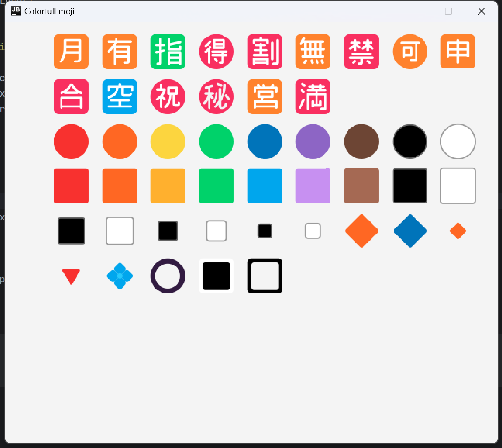
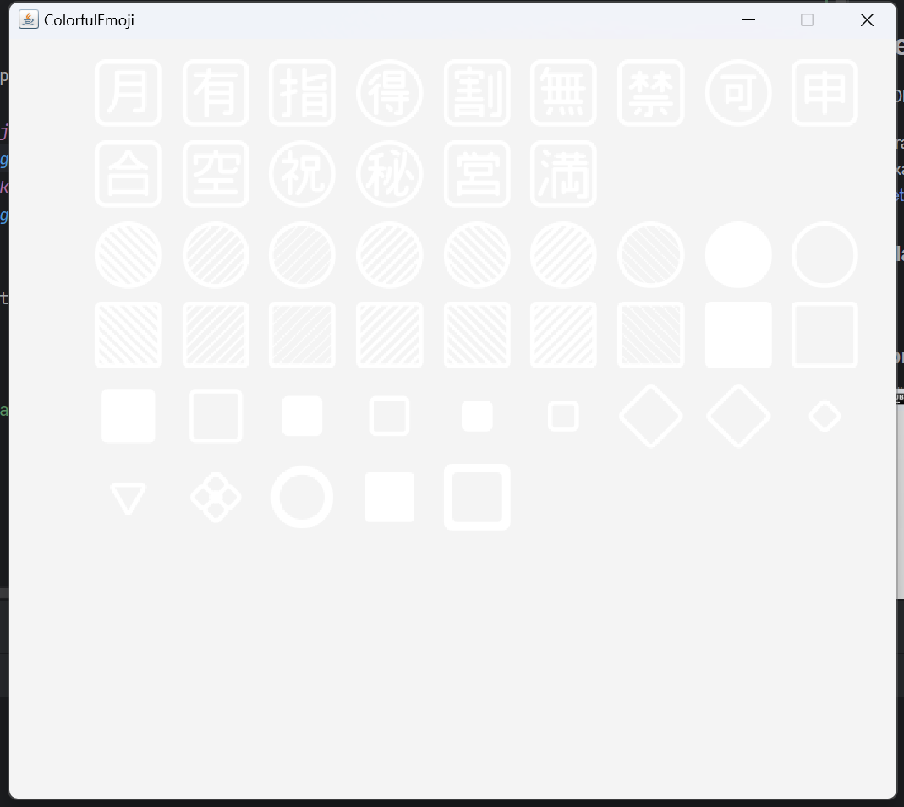

# Processing Template
This Project is a skeleton for using [Processing](https://processing.org/) with NORMAL IDE.
if anybody tend to use processing with Intellij IDEA,
instead of [PDE](https://processing.org/download), can use this template.

## requirement
JDK 17+

## setup
just import this project as a maven project

## verify
run the `main` in `Hello.java`, should see a window popup like this.

## emoji 
to run the Emoji Example,
the best openjdk build is JDK build by JetBrains, 
[JetBrainsRuntime](https://github.com/JetBrains/JetBrainsRuntime/releases)
other build may got monochrome output.

### jbr jdk

### plain jdk

