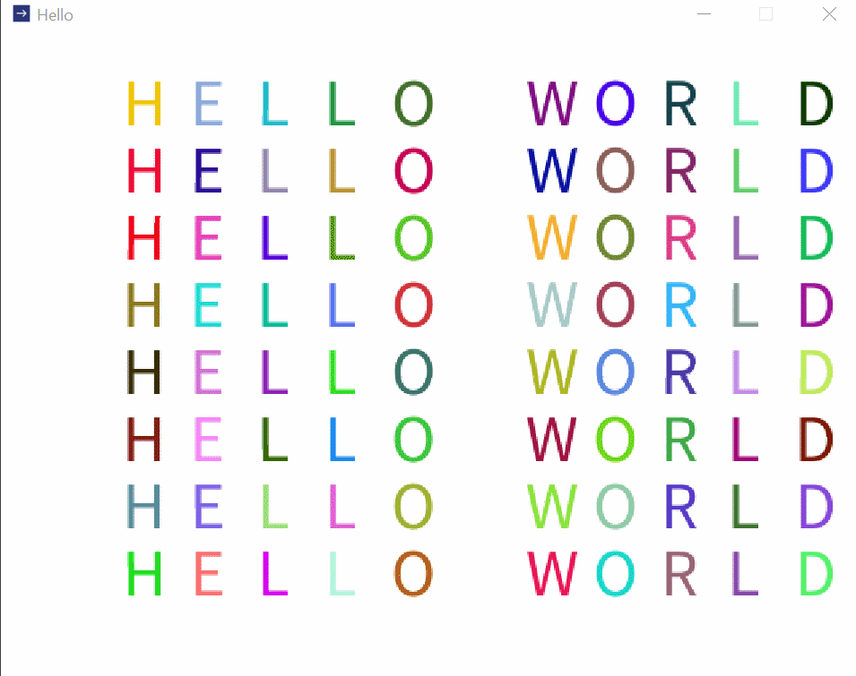

# Processing Template
This Project is a skeleton for using [Processing](https://processing.org/) with NORMAL IDE.
if anybody tend to use processing with Intellij IDEA,
instead of [PDE](https://processing.org/download), can use this template.

## setup
follow these step:

1. import this project as a maven project
2. right click on `lib` dir
3. select `Add as Library`

## verify
run the `main` in `Hello.java`, should see a window popup like this.


## tips
processing 4 require JDK >=11, if `JDK17`, add these to `VM Options` for reflect.

```
 --add-opens java.base/java.lang=ALL-UNNAMED 

```